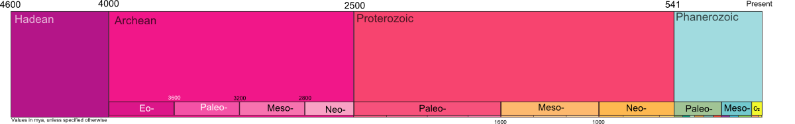
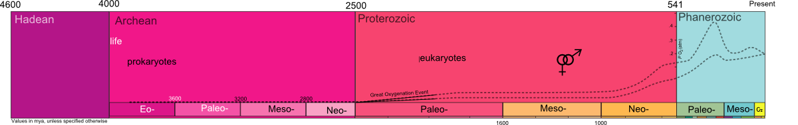

This is Earth

and this is 4600 million years of its existence.

well, only the length. The height is there to give time some body. This is the canvas to represent events in time. What makes sense to put on such gigantic scale? But first, who says it's gigantic? Do we really have a clear idea about how long "4600 million years""

here are some possible alternatives.
